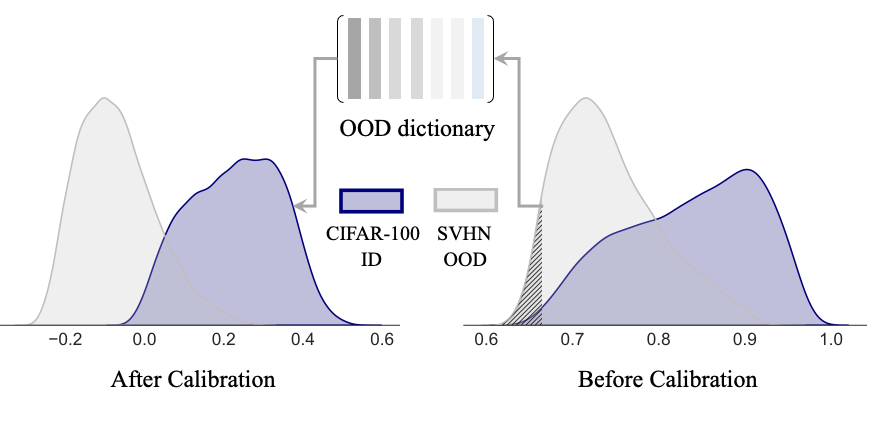

# OODD: Test-time Out-of-Distribution Detection with Dynamic Dictionary
Yifeng Yang, Lin Zhu, Zewen Sun, Hengyu Liu, Qinying Gu, Nanyang Ye 

[CVPR2025] The source code of "[OODD: Test-time Out-of-Distribution Detection with Dynamic Dictionary](#)".
<p align="center">
  
</p>  
Abstract: 
Out-of-distribution (OOD) detection remains challenging for deep learning models, particularly when test-time OOD samples differ significantly from training outliers. We propose \textbf{OODD}, a novel test-time OOD detection method that dynamically maintains and updates an OOD dictionary without fine-tuning. Our approach leverages a priority queue-based dictionary that accumulates representative OOD features during testing, combined with an informative inlier sampling strategy for in-distribution (ID) samples. To ensure stable performance during early testing, we propose a dual OOD stabilization mechanism that leverages strategically generated outliers derived from ID data. To our best knowledge, extensive experiments on the OpenOOD benchmark demonstrate that OODD significantly outperforms existing methods, achieving a 26.0\% improvement in FPR95 on CIFAR-100 Far OOD detection compared to the state-of-the-art approach. Furthermore, we present an optimized variant of the KNN-based OOD detection framework that achieves a 3x speedup while maintaining detection performance.

## Setup
Please refer to [OpenOOD](https://github.com/Jingkang50/OpenOOD/blob/main/README.md) for the CIFAR/ImageNet datasets and instructions on installing the OpenOOD benchmark.

## Running the code
### Download the checkpoints
The checkpoints (forked from OpenOOD) can be downloaded from this [link](https://drive.google.com/file/d/1vdwQoAfxBnIG43SDFIm2hCrDv3eA7uwv/view?usp=drive_link). Please download the checkpoints and put them in the `checkpoint` folder.
### Running 
```bash
cd OODD
bash bash.sh
```
## MCM + OODD
Please refer to `MCM+OODD_README.md` in the `MCM` folder.
## NegLabel + OODD
Please refer to `README.md` in the `NegLabel` folder.

## Acknowledgement
Our repo is developed based on [OpenOOD](https://github.com/Jingkang50/OpenOOD), [MCM](https://github.com/deeplearning-wisc/MCM), [NegLabel](https://github.com/XueJiang16/NegLabel).

